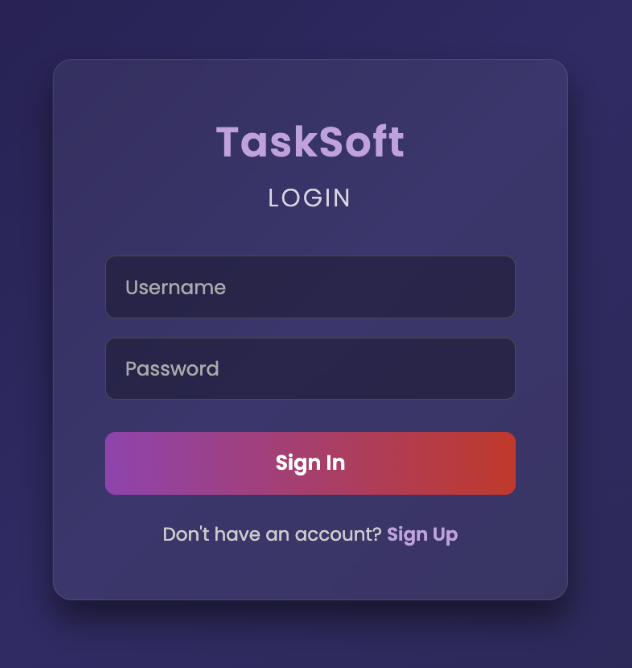
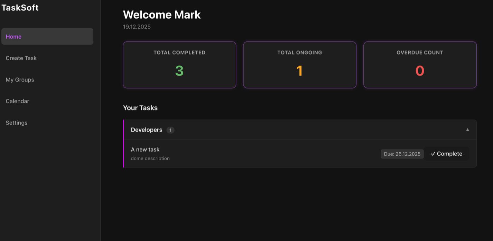
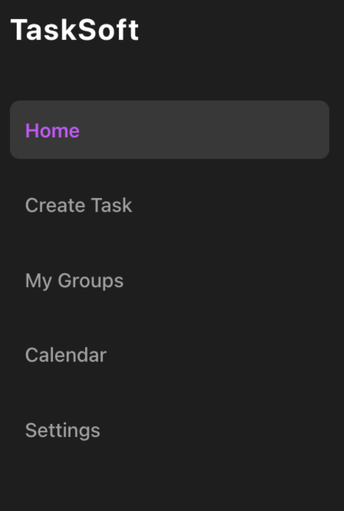
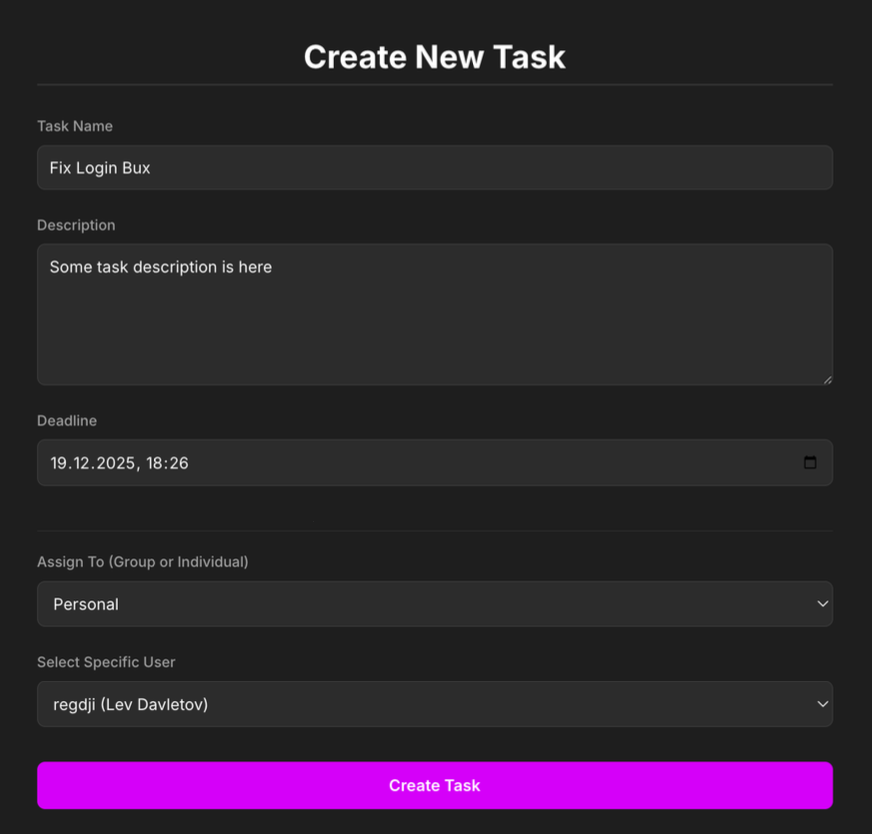

TaskSoft is a full-stack, enterprise-grade task management solution designed to optimize workforce efficiency through a microservices-based architecture. It replaces outdated coordination methods with a secure, scalable platform for task lifecycle management and role-based collaboration.

🚀 Key Features

- Role-Based Access Control (RBAC): Dynamic UI rendering that distinguishes between "Standard" and "Manager" views based on JWT claims. 
- Centralized Security: Implements a custom OAuth2 Authorization Server to manage user identities and security protocols. 
- Dual-Association Task Logic: Sophisticated data modeling that separates task creators (assigners) from executors (assignees). 
- Collaborative Group Workflows: Support for many-to-many user-group memberships, allowing tasks to be assigned to functional teams (e.g., DevOps, Frontend).

🛠 Technical Architecture
The system is built as a distributed ecosystem comprising four distinct services to ensure independent scalability and maintainability.

| Service | Technology Stack | Primary Responsibility |
| :--- | :--- | :--- |
| **Gateway Service** | Java, Spring Cloud Gateway | Acts as the single entry point (Edge Service), handling routing, CORS, and the Token Proxy handshake. |
| **Authorization Server** | Java, Spring Security, MySQL | Functions as the Identity Provider, issuing signed JWTs and handling secure user registration. |
| **Task Management** | Java, Spring Data JPA, PostgreSQL | Encapsulates core business logic for task creation, status updates, and database persistence. |
| **Frontend Client** | React.js | A Single Page Application (SPA) utilizing the Context API for state and hooks for non-blocking async logic. |

🔐 Security Implementation
- The project utilizes the Token Proxy Pattern (Gateway-mediated security). 
- Token Relay: The Gateway intercepts incoming session identifiers, retrieves the corresponding JWT, and propagates it to downstream services. 
- Defense-in-Depth: While the Gateway blocks unauthenticated traffic, the Task Management service acts as an OAuth2 Resource Server, validating every JWT signature locally.

**UI Walkthrough**

The primary result of this project is the successful deployment of a cohesive full-stack application. By effectively bridging the Java Spring Boot backend with the React.js frontend, the system functions as a unified entity. The application successfully handles the complete data lifecycle—from user input and validation on the client side, through secure transmission via the Gateway, to persistence in the PostgreSQL/MySQL databases.

The following figures demonstrate the key functional areas of TaskSoft, highlighting the implementation of security, state management, and role-based rendering.

 

<em><b>Figure 1: Centralized Login Interface.</b> This page is served by the Authorization Server, demonstrating the separation of the identity provider from the main application logic.</em> 

Upon successful authentication, users are redirected to the User Dashboard. The interface features a lateral sidebar for navigation and a central workspace providing a high-level overview of workload metrics: Completed, Ongoing, and Overdue tasks.

 

<em><b>Figure 2: User Dashboard.</b> The main landing page visualizing current task metrics and active workload categorized by functional groups.</em> 

Role-Based Access Control (RBAC)
A critical component of the frontend architecture is the implementation of RBAC within the navigation components. The sidebar utilizes conditional rendering based on the authorities present in the user’s security context.

 

<em><b>Figure 3: RBAC in UI.</b> (a) Standard User View vs (b) Manager View. The application dynamically renders administrative options like "Create Group" exclusively for Managers to enforce least-privilege access.</em> 

Task & Group Management
While standard users are restricted to self-assignment, Managers possess the authority to delegate work. The Task Creation and Group Management interfaces dynamically query the backend API to populate dropdowns with available users and functional teams.

  

<em><b>Figure 4:</b> Task Creation (left) and Group Management (right) interfaces for defining new functional teams and complex entity relationships.</em> 

